<p align="center">
  
</p>

<h1 align="center">Care</h1>

<p align="center"><strong>The people you love, finally in one place.</strong><br>
An iOS 27 app that turns looking after people into a ten-second habit. One profile per person, built from modules, with intelligence that remembers, notices and nudges for you.</p>

<p align="center">
  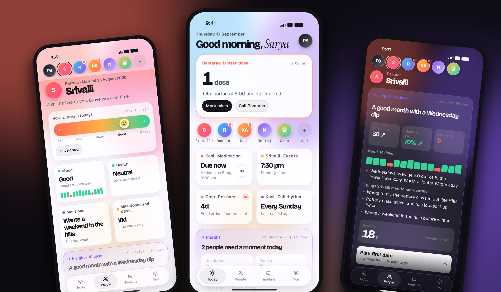
</p>

---

## What this is

Care is the Phase 0 build of the product described in [`SPEC.html`](SPEC.html): single user, fully local, no account. It is a complete, modular SwiftUI codebase for iOS 27 with a real design system, fourteen working modules, an insight engine that runs on device and switches to OpenAI or DeepSeek the moment you paste a key, a reminder planner, and a demo circle so the app is alive on first launch.

- **Four tabs.** Today, People, Timeline, You. Insights are not a tab; they live inside Today and inside every person, already rendered when you arrive.
- **Modules you switch on.** Mood, Health, Hydration, Mentions, Events, Milestones and dates, Travel plans, Shared checklist, Promises, Call rhythm, Medication, Appointments, Wishlist, and a new **Pet care** module for the dog. Eight more exist as store cards with tier labels for later.
- **One Home across everyone.** A deterministic ranker picks the one thing that needs you, then the orbs, then a bento of what is due.
- **Insights that render, not read.** The model answers only in typed blocks: headline, stat, trend, countdown, list, action, insight, mood strip, talking points, compare, note. Without a key, an on-device engine writes the same blocks from your own numbers.
- **Push with a reason.** Every reminder names a person, a reason and one action. Daily cap, quiet hours, medication exempt and time-sensitive.
- **Private by default.** Local SwiftData store. Keys in the Keychain. Export is one JSON file you own.

## Screens

These are **design renders** of the shipped SwiftUI screens, produced from the same fonts, tokens, copy and demo data the app uses, at iPhone 17 Pro size. They are not simulator captures: this build was written on a Linux machine with no Xcode, so the first real screenshots come from your Mac (see *Running it*). The renders exist so you can judge the design now.

The demo circle is the one you gave me: **Surya** (you), **Srivalli** (partner, married 26 August 2026), **Ramarao** (father, BP patient and pre-diabetic), **Kasi Annapurna** (mother, on BP medication, Sunday calls), **Neeraj** (brother) and **Oreo** (Shih Tzu). Birthdays, cities, doctors and medicine names in the demo are placeholders to edit in the app.

| Today | Srivalli | Ramarao |
|---|---|---|
| 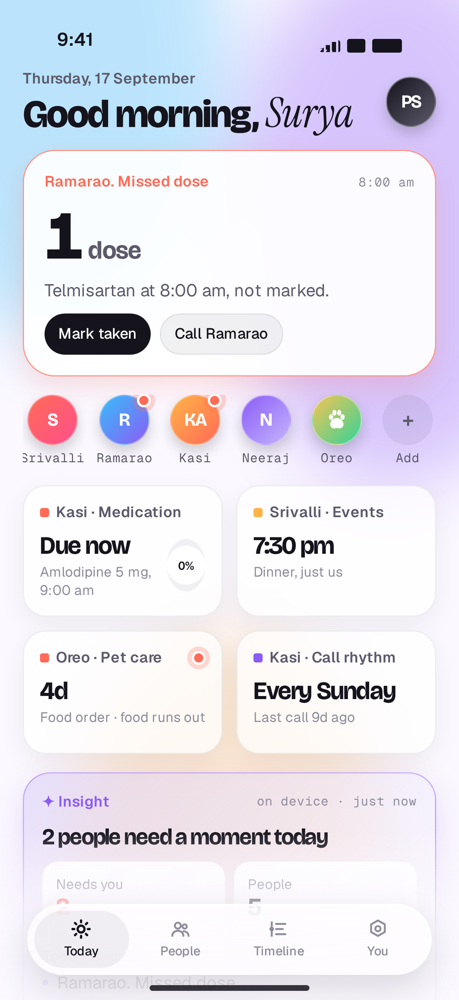 | 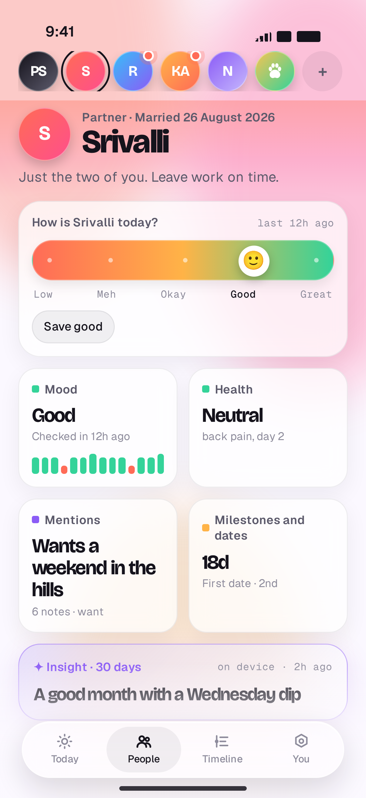 | 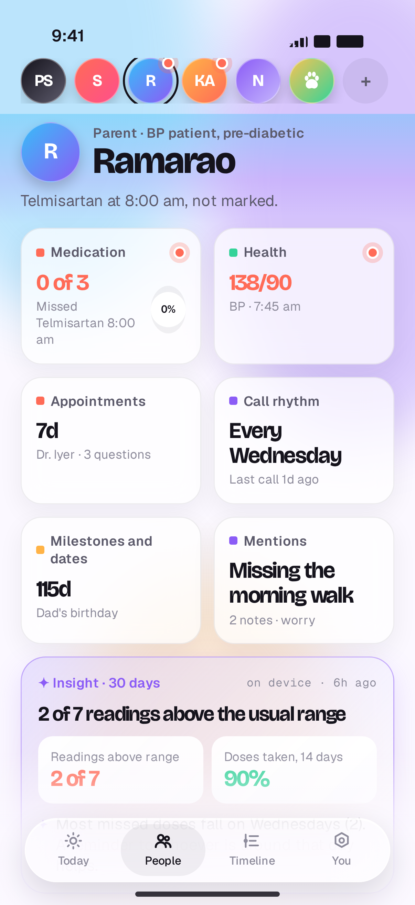 |
| The hero is Dad's missed 8 am Telmisartan. Orbs carry attention dots. The bento is ranked across everyone. The insight is written on device. | Aura header, the Pulse control, module tiles, the 30-day insight. Swipe left or right to change person; the aura crossfades. | Medication and a BP reading above range both raise attention. The insight names the pattern (Wednesdays) without diagnosing anything. |

| Medication | Timeline | Quick check-in |
|---|---|---|
| 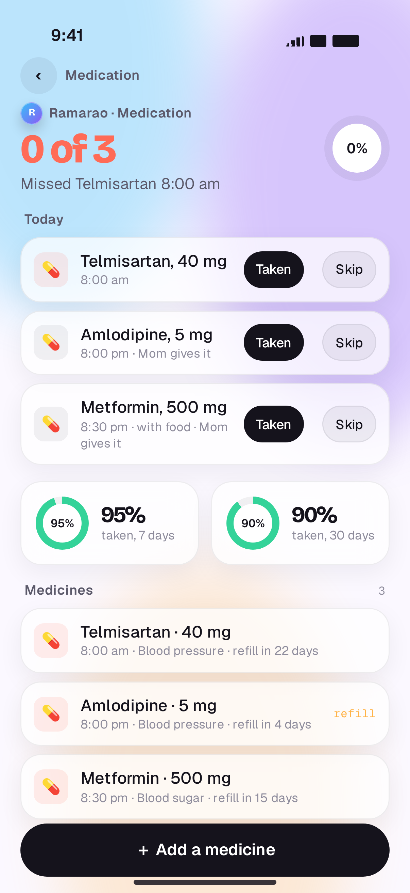 | 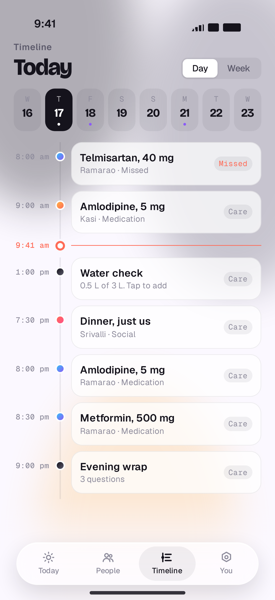 | 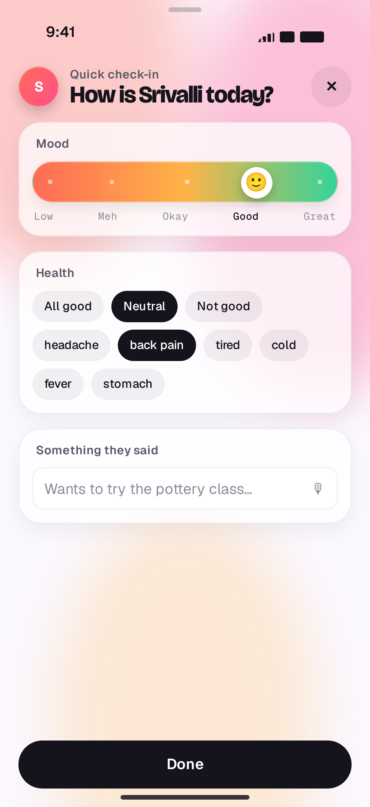 |
| Today's slots with Taken and Skip, adherence rings for 7 and 30 days, refill lead times. | Everyone's day on one rail, coloured by aura, with a live now marker and source labels. | One drag sets mood, chips set health, one line captures a mention. Done closes with a success haptic. |

| Insight, night mode | Module store | You and intelligence |
|---|---|---|
| 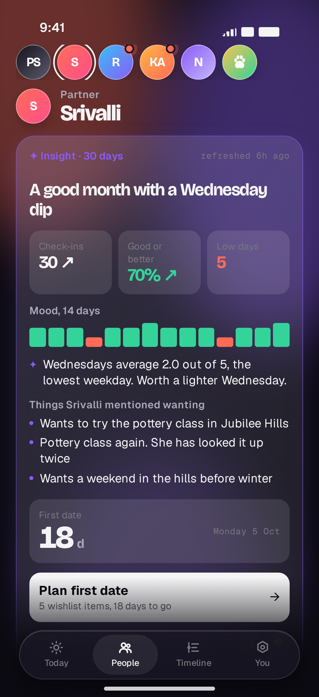 | 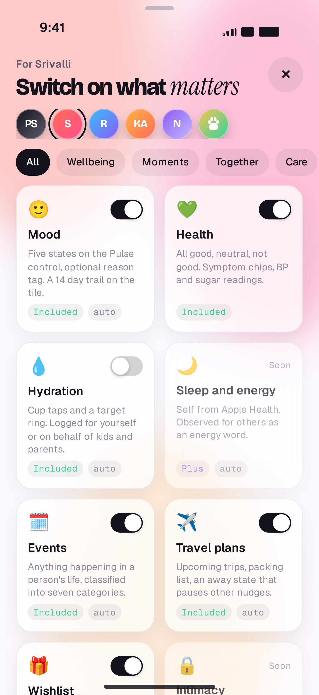 | 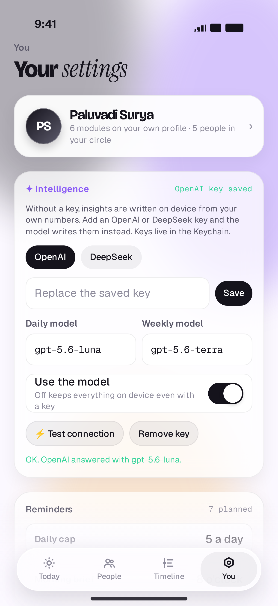 |
| Every block type in one card: stats, mood strip, insight, list, countdown, action, evidence line. | Every module as a card with its tier label, per person toggles, category chips. | Provider choice, key into the Keychain, editable model ids, a connection test, reminder controls. |

| Pet care, Oreo | Evening wrap | Onboarding |
|---|---|---|
| 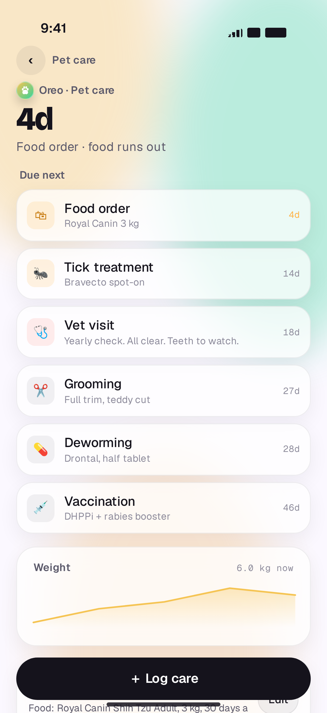 | 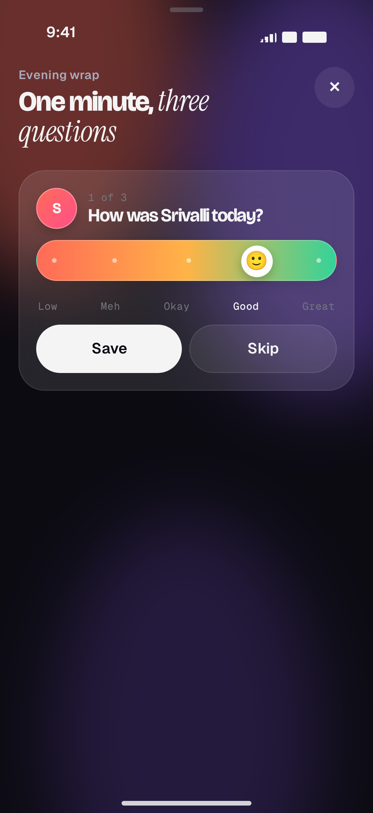 | 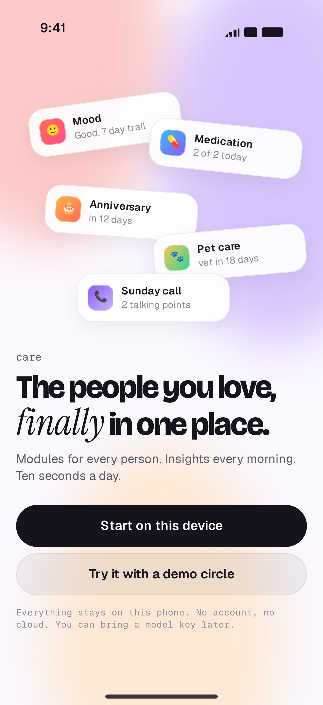 |
| Due dates for food, tick treatment, vet, grooming, deworming and vaccines, plus a weight trend. | Three questions about the people you saw today. Each answer is one tap. | One headline, two buttons. Start local, or load the demo circle. |

## Running it

You need a Mac with **Xcode 27** and an iPhone or simulator on **iOS 27**.

```bash
git clone https://github.com/paluvadisurya/care.git
cd care
open Care.xcodeproj
```

1. Select the **Care** scheme and a simulator, press Run.
2. On first launch choose **Try it with a demo circle** to see everything populated, or **Start on this device** to add your own people.
3. To run the logic tests: `cd Packages && swift test`. They cover ranking, the event taxonomy, payload round-trips, the insight contract and validator, the local engine, and reminder guardrails. They run on macOS and Linux without Xcode.

If Xcode refuses the hand-built project file, `brew install xcodegen && xcodegen generate` recreates it from `project.yml`. Set your team under Signing before running on a device.

**Honest status.** The Swift was written and reviewed without a compiler, because this session ran on Linux. Expect a handful of compile errors on the first build, fix them in place, and the design and structure are all there. I marked every iOS 27 API against Apple's exported Xcode 27 agent skills (`swiftui-whats-new-27`, `swiftui-specialist`) while writing.

## Bringing a model

Open **You › Intelligence**, pick OpenAI or DeepSeek, paste the key, tap Save, then **Test connection**. The key is stored in the Keychain and never leaves the device except in the request to that vendor. Model ids are editable; defaults are `gpt-5.6-luna` / `gpt-5.6-terra` for OpenAI and `deepseek-chat` / `deepseek-reasoner` for DeepSeek. Toggle **Use the model** off to stay on device even with a key.

What the model receives is compact: first names, module summaries, counts and dates, never photos, never free text longer than 140 characters per item. The system prompt is in [`PromptLibrary.swift`](Packages/Sources/CareIntelligence/Prompts/PromptLibrary.swift) and the strict schema in [`InsightSchema.swift`](Packages/Sources/CareIntelligence/Contract/InsightSchema.swift).

## Structure

```
Care.xcodeproj            Xcode 27 project. Everything under Care/ is a synchronised folder.
Care/                     App target: entry, router, Today, People, Timeline, You, store, onboarding, evening wrap.
Packages/                 One Swift package, seven modules (see docs/ARCHITECTURE.md).
  Sources/CareCore        Pure Swift. Records, module logic, ranking, deep links, taxonomy.
  Sources/CareIntelligence Pure Swift. Contract, schema, prompts, providers, validator, local engine.
  Sources/CareReminders   Pure Swift. Planner, guardrails, notification categories.
  Sources/CareFixtures    Pure Swift. The demo circle.
  Sources/CareDesign      SwiftUI design system: tokens, fonts, motion, components.
  Sources/CareData        SwiftData models, the store, preferences, insight coordinator, scheduler.
  Sources/CareModules     Module screens, quick logs, tiles, the insight block renderer.
  Tests/                  Swift Testing suites for the pure modules.
design/                   Icon source (SVG) and the screen render sources (HTML/CSS on the same tokens).
scripts/                  Playwright renderers for the icon and the screens.
docs/                     Architecture notes, rendered screens, icon previews.
SPEC.html                 The product and build spec, version 2. Source of truth.
```

Read [`docs/ARCHITECTURE.md`](docs/ARCHITECTURE.md) for how a module is built (two files and two registry lines), how ranking works, and how the intelligence pipeline validates what the model returns.

## Changing the look

- **Tokens**: [`CareColor.swift`](Packages/Sources/CareDesign/Tokens/CareColor.swift), [`CareFont.swift`](Packages/Sources/CareDesign/Tokens/CareFont.swift), [`CareSpace.swift`](Packages/Sources/CareDesign/Tokens/CareSpace.swift), [`CareMotion.swift`](Packages/Sources/CareDesign/Motion/CareMotion.swift). Colours are asset-catalogue tokens with light and night variants.
- **Onboarding**: [`OnboardingView.swift`](Care/Features/Onboarding/OnboardingView.swift). Three steps, each its own view.
- **Home**: [`TodayView.swift`](Care/Features/Today/TodayView.swift). The hero, orbs, bento and insight are separate sections.
- **A person**: [`PeopleView.swift`](Care/Features/People/PeopleView.swift) plus [`AuraHeader.swift`](Packages/Sources/CareDesign/Components/AuraHeader.swift).
- **Type**: Bricolage Grotesque (display), Geist (text), Geist Mono (metadata), Instrument Serif italic (one accent word per screen). All SIL Open Font License, bundled in `CareDesign/Resources/Fonts` with their licences.

## Roadmap seams already in the code

Contacts and Calendar import, Photos trips, HealthKit water, WeatherKit talking points, widgets, Live Activities, Siri intents, CloudKit sharing and the paywall each have a place to plug in: `importers` on `ModuleLogic`, `TimelineItem.source`, `NotificationCategorySpec`, and `EntitlementService.isUnlocked` (always true today). Sections 09 to 12 of the spec hold the plan and the prompt library for each milestone.

## Licence

Code: MIT. Fonts: SIL Open Font License 1.1, see `Packages/Sources/CareDesign/Resources/Fonts/Licenses`.
